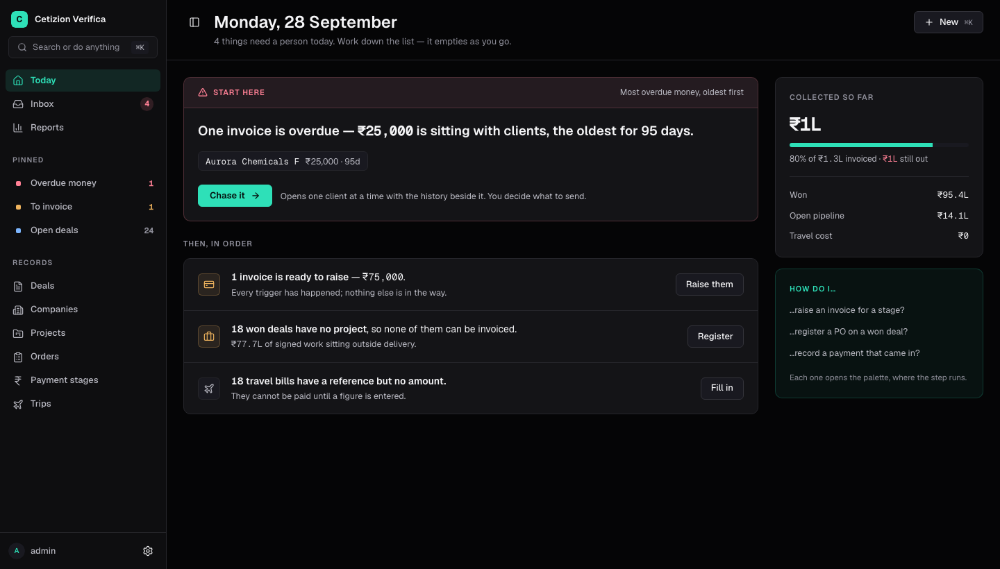
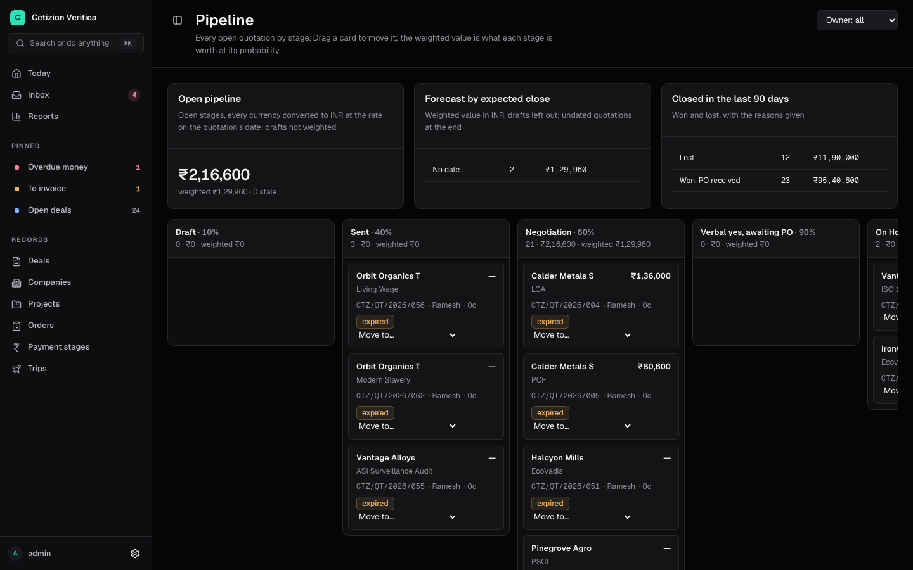
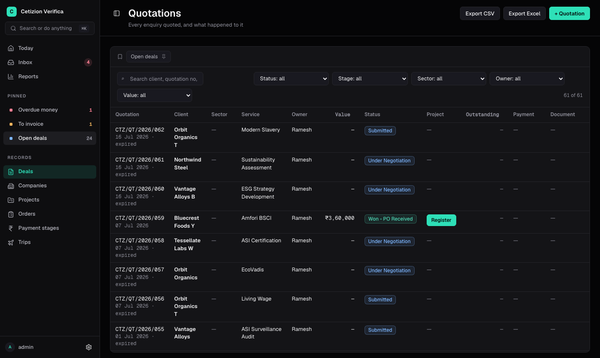
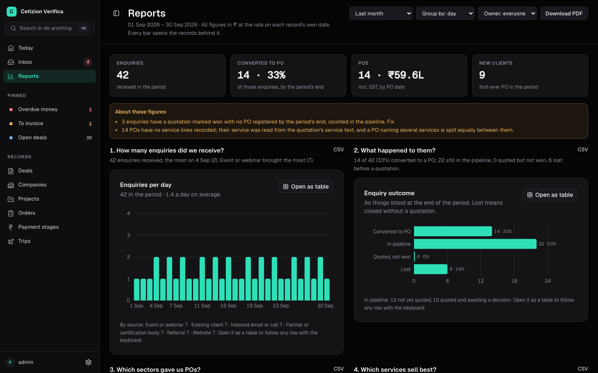

<div align="center">

# Cetizion Tracker

**The sales pipeline, project register, invoicing schedule and travel ledger —
in one place, where the numbers compute themselves.**

Node 24 · Express 5 · PostgreSQL 17 · React 19 · Tailwind 4

</div>

---

It began as `Cetizion_Sales_Expenses_and_Project_Tracker_final.xlsx`: nine sheets, a
column of formulas copied down by hand, and grey cells nobody was supposed to type in.

Everything those formulas computed, the database computes now. A stage amount, a due
date, an outstanding balance — none of them are stored, so none of them can drift out of
step with the facts they came from. A person types a fact once, in one place, and every
screen that needs it reads it from there.

<div align="center">
  
  <p><em><strong>Today</strong> — the most overdue money first, then everything else in order.<br>
  One primary action on the page; the list empties as you work down it.</em></p>
</div>

---

## What it does

**Sales.** Enquiries become quotations become deals. A pipeline board with stages and
probability, quotations as real documents with line items, GST and revisions, approval
for a discount, and a client-facing acceptance link.





*Every list works the same way: a saved view, filters that live in the URL so a link
carries them, and the next action on the row itself — a won deal offers **Register**
where the project would be.*

**A shared inbox.** Client email from a connected Microsoft 365 mailbox arrives already
matched to its company and its deal. Threads are assigned, have a reply clock, and turn
into an enquiry with one button. Messages render sandboxed, with remote images blocked
until asked for — a tracking pixel is a read receipt, and a client does not need to know
when you opened their revised terms.

**Money.** A purchase order carries its own payment schedule; a stage becomes invoiceable
on its own trigger — registration, delivery, a project milestone — and nobody marks it by
hand. Invoice runs, receipts, collections ageing, cash-flow forecasting, payables to
travel vendors, and profitability per project.



*Reports answers six questions for any period — enquiries received, what became of them,
sector-wise POs, service-wise sales, new and repeat customers, monthly revenue — on screen,
as CSVs and as one PDF, all from the same definitions. Every bar opens the records it
counted, and each chart opens as a table: a figure you cannot interrogate is a figure you
have to trust.*

**Delivery and travel.** Projects with onboarding checklists and milestones, site visit
scheduling, trips with vendor invoices and employee expense claims, and certificates with
their renewal dates.

**Around the edges.** A command palette over everything, reports as saved views, a client
portal, webhooks for n8n, an MCP server so Claude can answer questions from live data,
and a bulk importer that reads whatever shape of sales sheet it is handed.

---

## Quick start

You need **Node 24+** (the server runs TypeScript directly, via type stripping) and
**PostgreSQL 14+**.

```bash
# API
cd server
npm install
npm run reset          # create the database, apply schema + views, load seed data
npm run seed:demo      # optional — the workbook's worked example
npm start              # http://localhost:4000

# Web app, in a second terminal
cd web
npm install
npm run dev            # http://localhost:5173
```

Open <http://localhost:5173> and sign in with `admin` / `cetizion-dev`. The dev server
proxies `/api`, so the browser only ever talks to one origin.

> **`npm run migrate` drops every table.** It is a rebuild. On any database holding data
> you want — including a colleague's — use `npm run db:upgrade`.

### Configuration

Everything has a working default in development. To change one, copy
`server/.env.example` to `server/.env`.

| Variable | Default | |
| --- | --- | --- |
| `DATABASE_URL` | `postgres://localhost:5432/cetizion_tracker` | |
| `PORT` | `4000` | |
| `AUTH_MODE` | `shared` | `shared` or `database` — see [Signing in](#signing-in) |
| `AUTH_USERNAME` / `AUTH_PASSWORD` | `admin` / `cetizion-dev` | **required in production** |
| `SESSION_SECRET` | random per boot | **required in production**, 32+ chars |
| `SESSION_TTL_HOURS` | `12` | |
| `BUSINESS_TIME_ZONE` | `Asia/Kolkata` | decides the year in reference numbers |
| `CLOUDINARY_*` | none | needed for document uploads |
| `MS_CLIENT_ID` / `MS_CLIENT_SECRET` / `MS_TENANT_ID` | none | Microsoft sign-in and mailboxes |
| `GOOGLE_CLIENT_ID` / `GOOGLE_CLIENT_SECRET` | none | Google sign-in |
| `MAIL_TOKEN_KEY` | none | encrypts stored mailbox tokens |
| `OPENROUTER_API_KEY` | none | optional AI help in the bulk importer — **read [docs/bulk-import.md](docs/bulk-import.md) before setting it**, it sends sheet content to a third party |
| `OPENROUTER_MODEL` | `anthropic/claude-fable-5.1` | any model id OpenRouter serves; also `OPENROUTER_FALLBACK_MODELS`, `OPENROUTER_CHECK_MODEL`, `OPENROUTER_TRIAGE_MODEL` ([docs/email-auto-entry-plan.md](docs/email-auto-entry-plan.md) §4) |
| `EMAIL_MODE` | `log` | nothing is sent. `sandbox`: only `EMAIL_ALLOWLIST` addresses. `live`: over SMTP |
| `SMTP_HOST` / `_PORT` / `_SECURE` / `_USER` / `_PASS` | none | needed for `EMAIL_MODE=live` |
| `EMAIL_FROM` / `EMAIL_REPLY_TO` / `EMAIL_BCC` | none | the sender on every outgoing email |

Every email is written to `email_log` whatever the mode, so `log` gives a full dry run:
the reminder is composed and recorded, and marked `suppressed` because nothing left the
server. A stage only counts as chased once an email really goes out, so switching to
`live` sends the first real reminders that day rather than treating them as already sent.

The repository variable `CODEQL_ENABLED=true` turns on the CodeQL scan in CI. It is off
until GitHub code scanning is enabled for the repository; the other scans always run.

Generate a session secret:

```bash
node -e "console.log(require('crypto').randomBytes(32).toString('hex'))"
```

---

## Signing in

Two modes, chosen by `AUTH_MODE`.

**`shared`** — one username and one password, held in the environment. No accounts, no
roles; everybody who signs in is an admin. Good for a small deployment and the default in
development.

**`database`** — real accounts in a `users` table, each `admin`, `sales` or `hr`, with
per-person sessions you can see and revoke from **My account**. People can also sign in
with **Microsoft** or **Google** when those are configured, and link either to an
existing account.

| Role | Reaches |
| --- | --- |
| `admin` | Everything |
| `sales` | Their own enquiries, quotations, projects and POs, and the shared lists |
| `hr` | The travel desk only: trips, agency invoices and credit notes, the travel dashboard and payables, the travel vendor and trip type lists, and the travel import ([docs/travel-import.md](docs/travel-import.md)). POs and projects only as far as linking a trip needs |

What holds in both:

- The session is an `httpOnly`, `sameSite=lax` cookie signed with `SESSION_SECRET`.
  Changing that secret signs everyone out, which is how you revoke everything at once.
- Every `/api` route needs it except `/api/health`, which reveals only that the database
  answered.
- Ten failed attempts inside the lockout window (`signin_lockout_minutes`, 15 by
  default) locks sign-in for the rest of it. Signing in successfully clears the count,
  so getting it right on the eleventh try is not punished.
- **In production the API refuses to start without `AUTH_PASSWORD` and `SESSION_SECRET`.**
  A tracker that boots unlocked because a variable was missed is the exact failure this
  exists to prevent.

`sales` users see the money screens but not margin, and — as record-level scoping lands —
their own records rather than everybody's. The authorization matrix is a test, not a
convention: see `server/test/authorization.test.js` and
[docs/issue-18-authorization.md](docs/issue-18-authorization.md).

---

## The two ideas it is built on

### Nothing derived is stored

`payment_stages` holds the percent, the invoice number and the amount received. It does
**not** hold the stage amount, the due date, the status or the follow-up text.
`v_payment_stages` computes those on every read, exactly as the spreadsheet formula did:

```sql
WHEN NOT b.due_to_invoice                            THEN 'Not Due'
WHEN ps.invoice_no IS NULL                           THEN 'To Invoice'
WHEN ps.amount_received >= b.amount AND b.amount > 0 THEN 'Paid'
WHEN CURRENT_DATE > b.invoice_due_date               THEN 'Overdue'
WHEN ps.amount_received > 0                          THEN 'Partially Paid'
ELSE 'Due'
```

The same holds for PO totals, project rollups and the quotation's reflected columns. A
receipt recorded against one stage changes the PO, the project and the quotation on the
next page load, with no recalculation step to forget.

### Type any fact in exactly one place

Enforced by foreign keys rather than by discipline. A purchase order does not store a
client name — it belongs to a project, which has one. A vendor invoice does not store the
employee or the project — it belongs to a trip, which knows both.

---

## The flow

1. Log the enquiry on **Enquiries**. Qualifying it creates the quotation and links the two.
2. Price the quotation as **line items** — service, rate, GST — and send it. The client
   can accept it from a link.
3. When it is won, **Register the project**: creates the project, links the quotation,
   optionally applies the onboarding checklist.
4. Register the **purchase order**, add its service lines, and set its **payment stages**
   (50/50, 30/70, 40/30/30 — the builder checks they total 100%).
5. Stages become **To Invoice** on their own trigger, and appear on the worklist.
6. Finance invoices, then records receipts. Paid / Partially Paid / Overdue follows by
   itself.
7. Sales sees invoiced, received and outstanding on the quotation without touching
   finance's data.

Travel is the same shape: HR logs the trip once, the vendor's bill is recorded against
the travel ID, and finance is prompted by the following month-end. Employee claims attach
to the same trip and roll into the project's cost.

---

## Layout

```
cetizion-tracker/
├── server/
│   ├── db/
│   │   ├── schema.sql        tables — only facts a person types
│   │   ├── views.sql         every formula the workbook had, as SQL
│   │   ├── migrations/       numbered, run once, never edited after merge
│   │   └── seed.sql          the data the workbook carried
│   └── src/
│       ├── start.js          production entry: pending migrations, then the API
│       ├── migrations.js     the runner — schema_migrations, advisory lock
│       ├── auth/             sign-in, sessions, OAuth, the role gate
│       ├── lib/resources.js  one registry entry per resource, with its Zod schema
│       ├── lib/crud.js       turns a registry entry into a REST router
│       ├── lib/mailbox/      Microsoft Graph sync, classification, sanitising
│       ├── import/           the bulk sheet importer
│       └── routes/           dashboards, workflow actions, exports, webhooks, MCP
└── web/
    └── src/
        ├── styles/globals.css  Tailwind 4 theme, mapped onto the Mocha Glass tokens
        ├── styles/mocha/       Mocha Glass: tokens, the mg- classes, motion, pickers
        ├── components/ui/      Radix primitives in Mocha Glass; build from these
        ├── components/         ListPage, RecordForm, the shared dialogs
        └── pages/              one file per screen
```

The interface is **Mocha Glass**: light by default with a full dark theme,
Plus Jakarta Sans (Fraunces for page titles only), glass panels over a soft
scene, radii 14 for controls, 18 for menus, 26 for cards and 28 for dialogs.
Colours, radii and fonts come from the tokens in `web/src/styles/mocha/`, never
from hand-written values; screens use the `mg-` classes and `components/ui`.
Motion has a pause button and respects reduced motion.

---

## Database

| Command | What it does |
| --- | --- |
| `npm run db:create` | Create the database if it does not exist |
| `npm run db:upgrade` | Apply pending migrations, then views if needed — **keeps data** |
| `npm run migrate` | **Drop and rebuild** the schema and views |
| `npm run seed` | Load `db/seed.sql` |
| `npm run seed:demo` | Load `db/demo.sql` — the worked example |
| `npm run reset` | create → migrate → seed |

The table above is for a checkout on your own machine. **The container has no npm** —
it runs `node` and nothing else, so the scan covers every file in it. On the rare
occasion a migration has to be applied by hand inside the container, the command is:

```bash
docker exec <container> node server/scripts/db.js upgrade
```

A schema change goes in two places: `schema.sql`, and a new numbered file in
`db/migrations`. Each migration:

- **runs once**, in its own transaction together with its record, so it applies whole or
  not at all. Leave `BEGIN`/`COMMIT` out — the runner refuses a file that has them.
- **is never edited once merged.** A changed file is not run again; put the fix in a new
  migration.
- **must be additive and must never throw.** The container applies migrations before the
  API starts, while the previous container is still serving. A migration that fails takes
  the deploy down with it.
- **is checked by CI**, which applies it to the schema production has and fails if the
  result differs from a database built fresh from `schema.sql`.

---

## Tests

```bash
cd server
npm test                                                        # no database needed
TEST_DATABASE_URL=postgres://localhost:5432/postgres npm test   # + the DB-backed suites

cd web
npm test            # unit
npm run test:e2e    # Playwright
```

The DB-backed suites create and drop their own throwaway databases, so they never touch
your development data.

---

## Deploying

CI runs every check on every pull request. A push to `main` that passes them all moves
the `production` branch, and Dokploy deploys that. The container applies pending
migrations before the API starts.

More in [docs/operations.md](docs/operations.md), with
[docs/staging.md](docs/staging.md), [docs/backups.md](docs/backups.md) and
[docs/security.md](docs/security.md) alongside.

### The worker

Scheduled work runs in a second process, not in the API:

```bash
npm run worker --prefix server
```

**Without it nothing scheduled happens at all** — no payment reminders, no digests, no
mailbox sync, no exchange rates. The API still serves the app, and the admin "Run now"
button on Emails & jobs still runs a job by hand, so the absence is quiet.

In Dokploy it is a second application from the same image and the same environment,
with the start command changed to `node server/src/worker.js`. Run exactly one:
two workers would send every reminder twice.

The schedule lives in `server/src/jobs.js`, in the business time zone:

| Job | When | What it does |
| --- | --- | --- |
| `webhooks.deliver` | every minute | Sends webhook events to their endpoints and retries failed ones |
| `mail.sync` | every 5 minutes | A backstop: the API itself also pulls mail every minute (`MAIL_AUTOSYNC_SECONDS`), so the Inbox fills without anybody pressing Sync. Pulls new client email from connected mailboxes, registers the purchase orders clients send and records the invoices we send (docs/email-po-plan.md), and creates enquiries from new client requests (docs/email-enquiries.md) |
| `enquiries.backfill` | every 10 minutes | Reads each mailbox's past year of mail once, in runs of about four minutes, and creates the enquiries it finds |
| `pos.backfill` | every 10 minutes | Once a mailbox's enquiries are read, reads its past year of inbox mail once more for purchase orders, registering them without notifications or webhooks |
| `invoices.backfill` | every 10 minutes | Records the invoices we emailed whose PO has since arrived; once a mailbox's POs are read, reads its past year of sent mail once for the invoices in it, quietly and with no client reminders |
| `notifications.email` | every 10 minutes | Emails the notifications people asked to get by email |
| `ops.watch` | every 15 minutes | Checks the certificate, disk, backups and stuck jobs; alerts when something is wrong |
| `documents.purge` | 03:00 daily | Finishes interrupted document removals |
| `accounting.sync` | 06:30 daily | Compares invoices and payments with the books |
| `deliverables.daily` | 07:50 daily | Marks expired certificates; reminds owners before expiry |
| `notifications.daily` | 08:00 daily | Raises notifications for tasks, follow-ups, approvals, overdue invoices, renewals |
| `quotations.expire` | 08:15 daily | Marks quotations past their validity as lost |
| `notifications.digest` | 08:30 weekdays | Each person's digest of what is waiting for them |
| `renewals.daily` | 08:45 daily | Opens renewal quotations inside the lead time |
| `reminders.payment` | 09:00 weekdays | One email per client with overdue invoices, at most once per `reminder_interval_days` |
| `followups.daily` | 09:15 weekdays | Emails each owner the enquiries, quotations and overdue invoices due a follow-up (on the date of their next open task, an enquiry's follow-up date, or after a quiet period); tells management about the ones with nothing logged by the respond-by date. Off until `followup_enabled` is `true`; skips holidays |
| `notifications.weekly` | 09:00 Mondays | The admins' week in notifications |
| `finance.digest` | 09:30 weekdays | Summary to `finance_email`: stages to invoice, overdue invoices, reminders sent today |
| `visits.reminders` | 17:00 daily | Reminds the team, and the client where chosen, before a visit |
| `exchange.rates` | 21:00 weekdays | Fetches the ECB reference rates; hand-entered rates are left alone |

The finance digest runs after the payment reminders, so its count covers the same morning. The follow-up run comes after the payment reminders too, so the client reminders sent that morning are already marked as automated and do not count as someone following up (docs/follow-up-escalation-plan.md).

---

## API

Responses are `{ "data": … }`. Errors are
`{ "error": { "message": "…", "fields": { … } } }`. Everything except `/api/health`
needs a session and answers `401` without one.

**Resources** — `enquiries`, `quotations`, `projects`, `purchase-orders`,
`payment-stages`, `companies`, `contacts`, `travel-logs`, `vendor-invoices`,
`expense-claims`, and the settings lists. Each supports:

```
GET    /api/<resource>?q=&limit=&offset=&sort=col:desc&<filter>=value
GET    /api/<resource>/:id          # numeric id, or the human key (PRJ-2026-001)
POST   /api/<resource>
PATCH  /api/<resource>/:id
DELETE /api/<resource>/:id
```

**Composite reads** return a record with everything hanging off it:

```
GET /api/projects/:projectId/full         project + POs + stages + onboarding + travel
GET /api/purchase-orders/:poNumber/full   PO + services + stages + travel
GET /api/travel-logs/:travelId/full       trip + vendor invoices + claims
```

**Workflow actions** are the verbs, phrased as a person would say them:

```
POST /api/quotations/:id/send · /accept · /revise · /approval/request · /approval/decide
POST /api/quotations/:id/convert                    won quotation → project
POST /api/purchase-orders/:poNumber/stages          a payment split (must total 100%)
POST /api/payment-stages/:id/invoice · /payment
POST /api/vendor-invoices/:id/pay
POST /api/expense-claims/:id/decide · /reimburse
POST /api/inbox/:id/reply · /convert
```

Also: `/api/dashboard/*` for every screen's figures, `/api/export/<resource>.csv|xlsx`,
`/api/search` behind the command palette, `/api/webhooks` for n8n
([docs/webhooks-n8n.md](docs/webhooks-n8n.md)), and `/api/mcp` for assistants
([docs/mcp.md](docs/mcp.md)).
